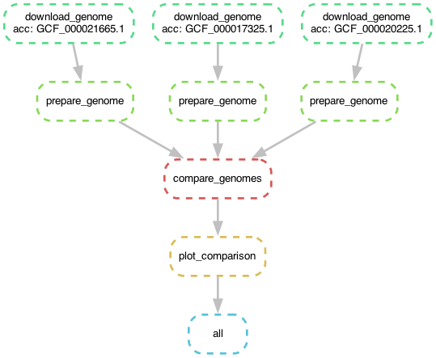

# 2023-ggg298-sourmash-compare

[](https://zenodo.org/badge/latestdoi/587375230)

A simple snakemake workflow comparing three genomes.

[](https://mybinder.org/v2/gh/ngs-docs/2023-ggg298-sourmash-compare/stable?urlpath=rstudio)

Run it like so:

```
snakemake -j 4 --use-conda
```

## Information and links

This repo provides a
[snakemake workflow](https://snakemake.readthedocs.io/) that uses
[sourmash](https://sourmash.readthedocs.io/) to compare three genomes
and generate a similarity matrix. All of the necessary software is
installed by [conda](https://docs.conda.io/en/latest/).

The snakemake workflow is described in the [Snakefile](https://github.com/ngs-docs/2023-ggg298-sourmash-compare/blob/main/Snakefile).

The required software is listed in [binder/environment.yml](https://github.com/ngs-docs/2023-ggg298-sourmash-compare/blob/main/binder/environment.yml).

## Workflow diagram


